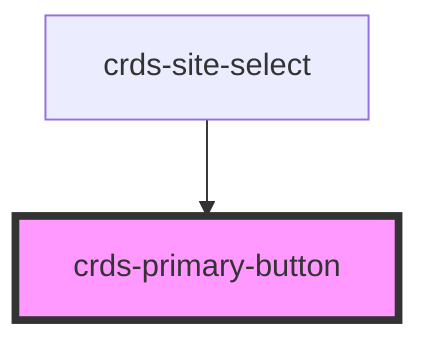

# crds-primary-button

<!-- Auto Generated Below -->

## Properties

| Property  | Attribute | Description | Type                          | Default     |
| --------- | --------- | ----------- | ----------------------------- | ----------- |
| `color`   | `color`   |             | `string`                      | `undefined` |
| `href`    | `href`    |             | `string`                      | `undefined` |
| `onClick` | --        |             | `(event: MouseEvent) => void` | `undefined` |
| `text`    | `text`    |             | `string`                      | `undefined` |

## Dependencies

### Used by

 - [crds-site-select](../../../crds-site-select)

### Graph

----------------------------------------------

*Built with [StencilJS](https://stenciljs.com/)*
