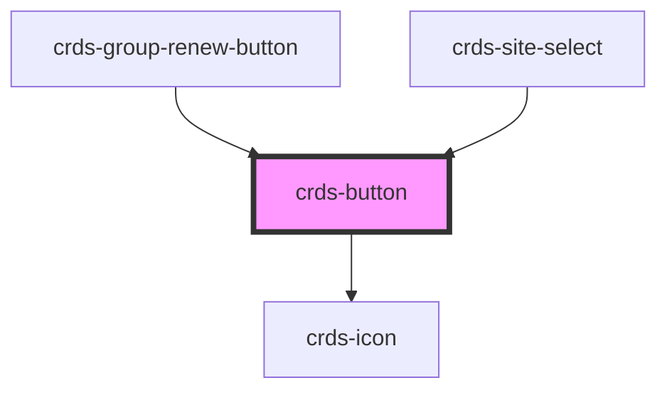

# crds-button

<!-- Auto Generated Below -->

## Properties

| Property    | Attribute    | Description | Type                          | Default     |
| ----------- | ------------ | ----------- | ----------------------------- | ----------- |
| `block`     | `block`      |             | `boolean`                     | `undefined` |
| `color`     | `color`      |             | `string`                      | `undefined` |
| `disabled`  | `disabled`   |             | `boolean`                     | `undefined` |
| `display`   | `display`    |             | `string`                      | `undefined` |
| `href`      | `href`       |             | `string`                      | `undefined` |
| `icon`      | `icon`       |             | `string`                      | `undefined` |
| `iconAlign` | `icon-align` |             | `string`                      | `undefined` |
| `iconColor` | `icon-color` |             | `string`                      | `undefined` |
| `iconSize`  | `icon-size`  |             | `string`                      | `undefined` |
| `onClick`   | --           |             | `(event: MouseEvent) => void` | `undefined` |
| `secondary` | `secondary`  |             | `boolean`                     | `undefined` |
| `size`      | `size`       |             | `string`                      | `undefined` |
| `text`      | `text`       |             | `string`                      | `undefined` |

## Dependencies

### Used by

 - [crds-group-renew-button](../../crds-group-renew-button)
 - [crds-site-select](../../crds-site-select)

### Depends on

- [crds-icon](../../crds-icon)

### Graph

----------------------------------------------

*Built with [StencilJS](https://stenciljs.com/)*
