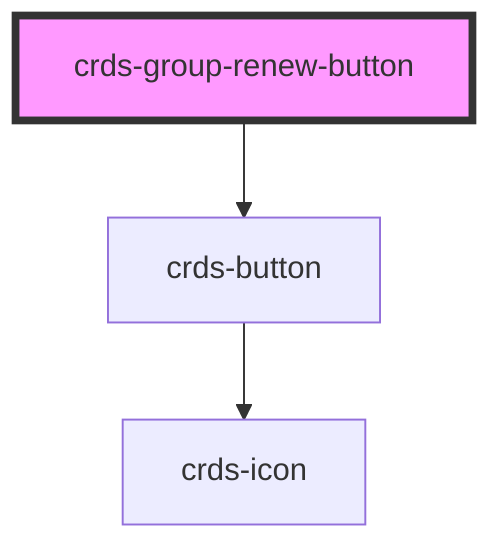

# crds-group-renew-button

<!-- Auto Generated Below -->

## Properties

| Property           | Attribute            | Description | Type     | Default     |
| ------------------ | -------------------- | ----------- | -------- | ----------- |
| `daysToExpiration` | `days-to-expiration` |             | `number` | `undefined` |
| `groupId`          | `group-id`           |             | `number` | `undefined` |

## Dependencies

### Depends on

- [crds-button](../DDK/buttons)

### Graph

----------------------------------------------

*Built with [StencilJS](https://stenciljs.com/)*
