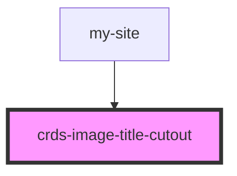

# crds-image-title-cutout

<!-- Auto Generated Below -->

## Properties

| Property    | Attribute    | Description | Type     | Default     |
| ----------- | ------------ | ----------- | -------- | ----------- |
| `imageHref` | `image-href` |             | `string` | `undefined` |
| `imageUrl`  | `image-url`  |             | `string` | `undefined` |
| `title`     | `title`      |             | `string` | `undefined` |
| `titleHref` | `title-href` |             | `string` | `undefined` |

## Dependencies

### Used by

 - [my-site](../crds-shared-header/profile-nav/my-site)

### Graph

----------------------------------------------

*Built with [StencilJS](https://stenciljs.com/)*
