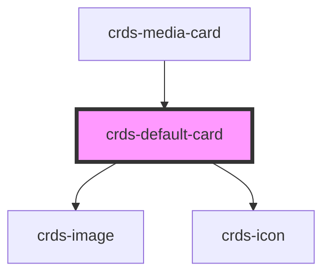

# crds-default-card

<!-- Auto Generated Below -->

## Properties

| Property       | Attribute       | Description | Type     | Default     |
| -------------- | --------------- | ----------- | -------- | ----------- |
| `body`         | `body`          |             | `string` | `undefined` |
| `buttonSrc`    | `button-src`    |             | `string` | `undefined` |
| `category`     | `category`      |             | `string` | `undefined` |
| `contentType`  | `content-type`  |             | `string` | `undefined` |
| `heading`      | `heading`       |             | `string` | `undefined` |
| `imageSrc`     | `image-src`     |             | `string` | `undefined` |
| `mediaLabel`   | `media-label`   |             | `string` | `undefined` |
| `meta`         | `meta`          |             | `string` | `undefined` |
| `thumbnailSrc` | `thumbnail-src` |             | `string` | `undefined` |
| `url`          | `url`           |             | `string` | `undefined` |

## Dependencies

### Used by

 - [crds-media-card](../..)

### Depends on

- [crds-image](../../../crds-image)
- [crds-icon](../../../crds-icon)

### Graph

----------------------------------------------

*Built with [StencilJS](https://stenciljs.com/)*
