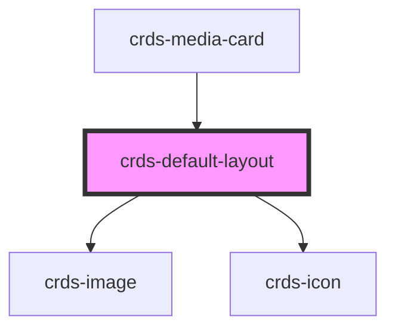

# crds-default-layout

<!-- Auto Generated Below -->

## Properties

| Property        | Attribute        | Description | Type     | Default     |
| --------------- | ---------------- | ----------- | -------- | ----------- |
| `author`        | `author`         |             | `string` | `undefined` |
| `body`          | `body`           |             | `string` | `undefined` |
| `buttonSrc`     | `button-src`     |             | `string` | `undefined` |
| `contentCount`  | `content-count`  |             | `number` | `undefined` |
| `contentType`   | `content-type`   |             | `string` | `undefined` |
| `heading`       | `heading`        |             | `string` | `undefined` |
| `imageSrc`      | `image-src`      |             | `string` | `undefined` |
| `mediaTopic`    | `media-topic`    |             | `string` | `undefined` |
| `meta`          | `meta`           |             | `string` | `undefined` |
| `metaPosition`  | `meta-position`  |             | `string` | `undefined` |
| `nearestMinute` | `nearest-minute` |             | `string` | `undefined` |
| `thumbnailSrc`  | `thumbnail-src`  |             | `string` | `undefined` |
| `url`           | `url`            |             | `string` | `undefined` |

## Dependencies

### Used by

 - [crds-media-card](../..)

### Depends on

- [crds-image](../../../crds-image)
- [crds-icon](../../../crds-icon)

### Graph

----------------------------------------------

*Built with [StencilJS](https://stenciljs.com/)*
