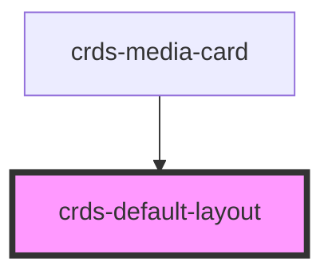

# crds-default-layout

<!-- Auto Generated Below -->

## Properties

| Property       | Attribute         | Description | Type     | Default     |
| -------------- | ----------------- | ----------- | -------- | ----------- |
| `body`         | `body`            |             | `string` | `undefined` |
| `heading`      | `heading`         |             | `string` | `undefined` |
| `image`        | `image`           |             | `string` | `undefined` |
| `meta`         | `meta`            |             | `string` | `undefined` |
| `metaPosition` | `meta-position`   |             | `string` | `undefined` |
| `src`          | `src`             |             | `string` | `undefined` |
| `thumbnailSRC` | `thumbnail-s-r-c` |             | `string` | `undefined` |
| `url`          | `url`             |             | `string` | `undefined` |

## Dependencies

### Used by

 - [crds-media-card](../..)

### Graph

----------------------------------------------

*Built with [StencilJS](https://stenciljs.com/)*
