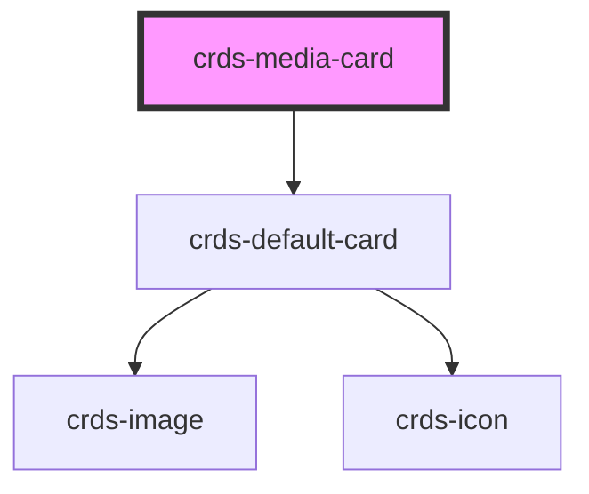

# crds-media-card

<!-- Auto Generated Below -->

## Properties

| Property        | Attribute        | Description | Type     | Default     |
| --------------- | ---------------- | ----------- | -------- | ----------- |
| `body`          | `body`           |             | `string` | `undefined` |
| `category`      | `category`       |             | `string` | `undefined` |
| `contentLayout` | `content-layout` |             | `string` | `'default'` |
| `contentType`   | `content-type`   |             | `string` | `undefined` |
| `heading`       | `heading`        |             | `string` | `undefined` |
| `imageSrc`      | `image-src`      |             | `string` | `undefined` |
| `mediaLabel`    | `media-label`    |             | `string` | `undefined` |
| `meta`          | `meta`           |             | `string` | `undefined` |
| `thumbnailSrc`  | `thumbnail-src`  |             | `string` | `undefined` |
| `url`           | `url`            |             | `string` | `undefined` |

## Dependencies

### Depends on

- [crds-default-card](layouts/crds-default-card)

### Graph

----------------------------------------------

*Built with [StencilJS](https://stenciljs.com/)*
