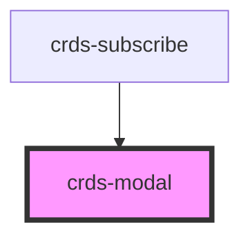

# crds-modal

<!-- Auto Generated Below -->

## Properties

| Property   | Attribute   | Description | Type       | Default     |
| ---------- | ----------- | ----------- | ---------- | ----------- |
| `isActive` | `is-active` |             | `boolean`  | `false`     |
| `onClose`  | --          |             | `Function` | `undefined` |
| `title`    | `title`     |             | `string`   | `undefined` |

## Dependencies

### Used by

 - [crds-subscribe](../crds-subscribe)

### Graph

----------------------------------------------

*Built with [StencilJS](https://stenciljs.com/)*
