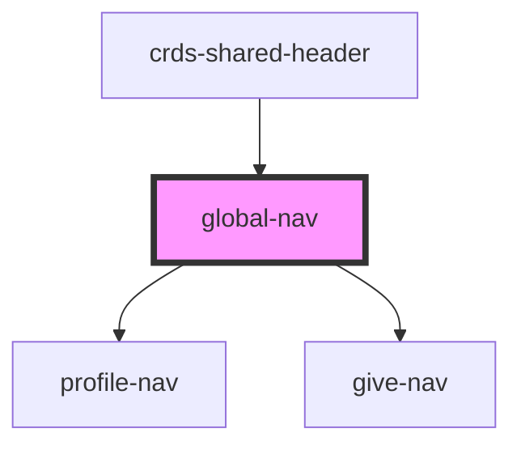

# global-nav

<!-- Auto Generated Below -->

## Properties

| Property              | Attribute                | Description | Type       | Default     |
| --------------------- | ------------------------ | ----------- | ---------- | ----------- |
| `config`              | --                       |             | `Object`   | `undefined` |
| `env`                 | `env`                    |             | `string`   | `undefined` |
| `giveData`            | --                       |             | `JSON`     | `undefined` |
| `giveNavIsShowing`    | `give-nav-is-showing`    |             | `boolean`  | `false`     |
| `href`                | `href`                   |             | `string`   | `undefined` |
| `mainNavIsShowing`    | `main-nav-is-showing`    |             | `boolean`  | `false`     |
| `navClickHandler`     | --                       |             | `Function` | `undefined` |
| `profileData`         | --                       |             | `JSON`     | `undefined` |
| `profileNavIsShowing` | `profile-nav-is-showing` |             | `boolean`  | `false`     |

## Dependencies

### Used by

 - [crds-shared-header](..)

### Depends on

- [profile-nav](..\profile-nav)
- [give-nav](..\profile-nav)

### Graph

----------------------------------------------

*Built with [StencilJS](https://stenciljs.com/)*
