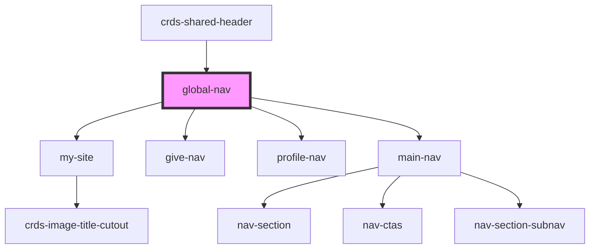

# global-nav

<!-- Auto Generated Below -->

## Properties

| Property | Attribute | Description | Type     | Default     |
| -------- | --------- | ----------- | -------- | ----------- |
| `data`   | `data`    |             | `any`    | `{}`        |
| `env`    | `env`     |             | `string` | `undefined` |

## Dependencies

### Used by

 - [crds-shared-header](..)

### Depends on

- [my-site](../profile-nav/my-site)
- [give-nav](../profile-nav)
- [profile-nav](../profile-nav)
- [main-nav](../main-nav)

### Graph

----------------------------------------------

*Built with [StencilJS](https://stenciljs.com/)*
