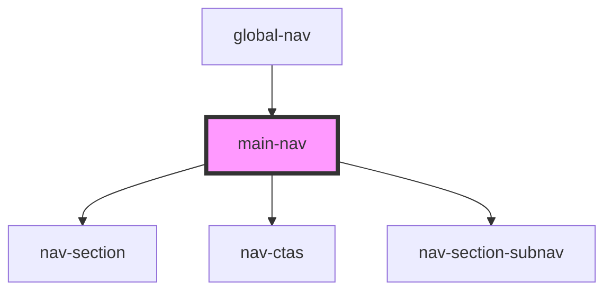

# main-nav

<!-- Auto Generated Below -->

## Properties

| Property       | Attribute        | Description | Type      | Default     |
| -------------- | ---------------- | ----------- | --------- | ----------- |
| `data`         | `data`           |             | `any`     | `[]`        |
| `isNavShowing` | `is-nav-showing` |             | `boolean` | `true`      |
| `promoData`    | `promo-data`     |             | `string`  | `undefined` |

## Dependencies

### Used by

 - [global-nav](../global-nav)

### Depends on

- [nav-section](../nav-section)
- [nav-ctas](../nav-ctas)
- [nav-section-subnav](../nav-section-subnav)

### Graph

----------------------------------------------

*Built with [StencilJS](https://stenciljs.com/)*
