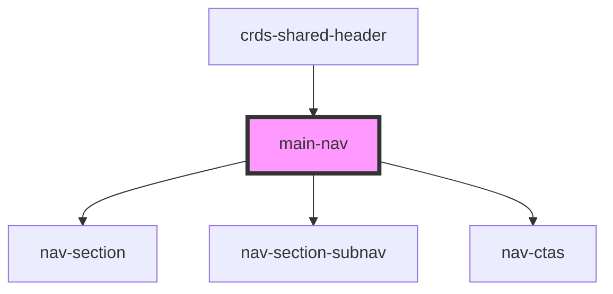

# main-nav

<!-- Auto Generated Below -->

## Properties

| Property           | Attribute             | Description | Type      | Default     |
| ------------------ | --------------------- | ----------- | --------- | ----------- |
| `data`             | --                    |             | `JSON`    | `undefined` |
| `mainNavIsShowing` | `main-nav-is-showing` |             | `boolean` | `true`      |
| `promoData`        | `promo-data`          |             | `string`  | `undefined` |

## Dependencies

### Used by

 - [crds-shared-header](..)

### Depends on

- [nav-section](../nav-section)
- [nav-section-subnav](../nav-section-subnav)
- [nav-ctas](../nav-ctas)

### Graph

----------------------------------------------

*Built with [StencilJS](https://stenciljs.com/)*
