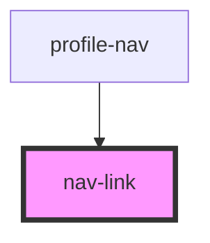

# nav-link

<!-- Auto Generated Below -->

## Properties

| Property       | Attribute       | Description | Type     | Default     |
| -------------- | --------------- | ----------- | -------- | ----------- |
| `automationId` | `automation-id` |             | `string` | `undefined` |
| `href`         | `href`          |             | `string` | `undefined` |

## Events

| Event            | Description | Type               |
| ---------------- | ----------- | ------------------ |
| `signOutClicked` |             | `CustomEvent<any>` |

## Dependencies

### Used by

 - [profile-nav](../profile-nav)

### Graph

----------------------------------------------

*Built with [StencilJS](https://stenciljs.com/)*
