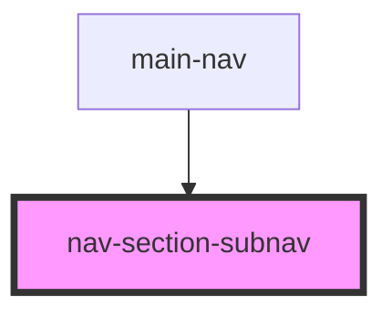

# nav-section-subnav

<!-- Auto Generated Below -->

## Properties

| Property          | Attribute      | Description | Type       | Default     |
| ----------------- | -------------- | ----------- | ---------- | ----------- |
| `handleBackClick` | --             |             | `Function` | `undefined` |
| `isActive`        | `is-active`    |             | `boolean`  | `false`     |
| `subNavName`      | `sub-nav-name` |             | `string`   | `undefined` |

## Dependencies

### Used by

 - [main-nav](..\main-nav)

### Graph

----------------------------------------------

*Built with [StencilJS](https://stenciljs.com/)*
