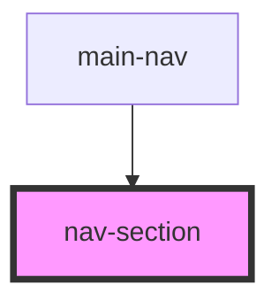

# nav-section

<!-- Auto Generated Below -->

## Properties

| Property      | Attribute      | Description | Type       | Default     |
| ------------- | -------------- | ----------- | ---------- | ----------- |
| `handleClick` | --             |             | `Function` | `undefined` |
| `isActive`    | `is-active`    |             | `boolean`  | `false`     |
| `sectionName` | `section-name` |             | `string`   | `undefined` |

## Dependencies

### Used by

 - [main-nav](../main-nav)

### Graph

----------------------------------------------

*Built with [StencilJS](https://stenciljs.com/)*
