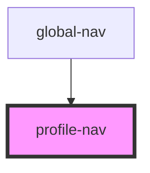

# give-nav

<!-- Auto Generated Below -->

## Properties

| Property        | Attribute        | Description | Type       | Default     |
| --------------- | ---------------- | ----------- | ---------- | ----------- |
| `data`          | `data`           |             | `any`      | `{}`        |
| `handleSignOut` | --               |             | `Function` | `undefined` |
| `isNavShowing`  | `is-nav-showing` |             | `boolean`  | `true`      |
| `user`          | `user`           |             | `any`      | `undefined` |

## Dependencies

### Used by

 - [global-nav](../global-nav)

### Graph

----------------------------------------------

*Built with [StencilJS](https://stenciljs.com/)*
