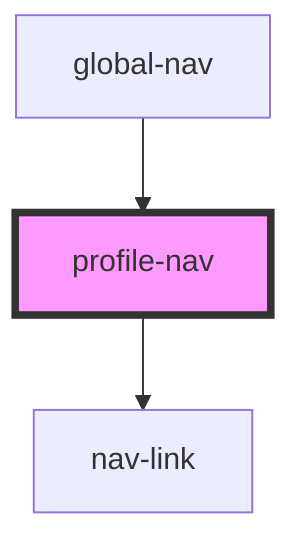

# give-nav

<!-- Auto Generated Below -->

## Properties

| Property              | Attribute                | Description | Type       | Default     |
| --------------------- | ------------------------ | ----------- | ---------- | ----------- |
| `config`              | `config`                 |             | `any`      | `undefined` |
| `currentUser`         | `current-user`           |             | `any`      | `undefined` |
| `data`                | --                       |             | `JSON`     | `undefined` |
| `onSignOut`           | --                       |             | `Function` | `undefined` |
| `profileNavIsShowing` | `profile-nav-is-showing` |             | `boolean`  | `true`      |

## Dependencies

### Used by

 - [global-nav](../global-nav)

### Depends on

- [nav-link](../nav-link)

### Graph

----------------------------------------------

*Built with [StencilJS](https://stenciljs.com/)*
