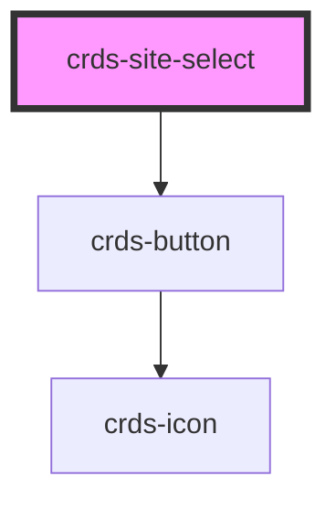

# crds-site-select

<!-- Auto Generated Below -->

## Properties

| Property     | Attribute      | Description | Type     | Default     |
| ------------ | -------------- | ----------- | -------- | ----------- |
| `cardSiteId` | `card-site-id` |             | `number` | `undefined` |

## Events

| Event     | Description | Type               |
| --------- | ----------- | ------------------ |
| `siteSet` |             | `CustomEvent<any>` |

## Dependencies

### Depends on

- [crds-button](../DDK/buttons)

### Graph

----------------------------------------------

*Built with [StencilJS](https://stenciljs.com/)*
