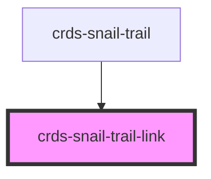

# snail-trail-link

<!-- Auto Generated Below -->

## Properties

| Property       | Attribute       | Description | Type      | Default     |
| -------------- | --------------- | ----------- | --------- | ----------- |
| `automationId` | `automation-id` |             | `string`  | `undefined` |
| `href`         | `href`          |             | `string`  | `'#'`       |
| `isActive`     | `is-active`     |             | `boolean` | `undefined` |

## Dependencies

### Used by

 - [crds-snail-trail](..)

### Graph

----------------------------------------------

*Built with [StencilJS](https://stenciljs.com/)*
