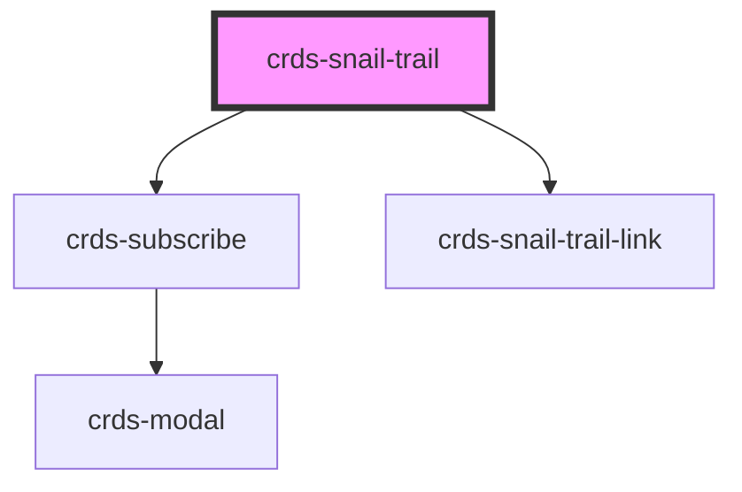

# snail-trail

<!-- Auto Generated Below -->

## Properties

| Property | Attribute | Description | Type     | Default     |
| -------- | --------- | ----------- | -------- | ----------- |
| `env`    | `env`     |             | `string` | `'prod'`    |
| `name`   | `name`    |             | `string` | `undefined` |
| `src`    | `src`     |             | `string` | `undefined` |

## Dependencies

### Depends on

- [crds-subscribe](../crds-subscribe)
- [crds-snail-trail-link](crds-snail-trail-link)

### Graph

----------------------------------------------

*Built with [StencilJS](https://stenciljs.com/)*
