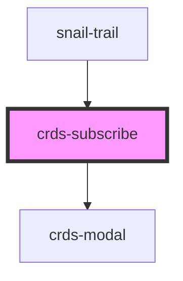

# crds-subscribe

<!-- Auto Generated Below -->

## Properties

| Property | Attribute | Description | Type     | Default     |
| -------- | --------- | ----------- | -------- | ----------- |
| `src`    | `src`     |             | `string` | `undefined` |
| `title`  | `title`   |             | `string` | `undefined` |

## Dependencies

### Used by

 - [snail-trail](../snail-trail)

### Depends on

- [crds-modal](../crds-modal)

### Graph

----------------------------------------------

*Built with [StencilJS](https://stenciljs.com/)*
