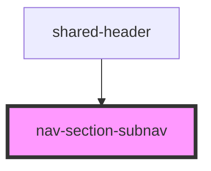

# nav-section-subnav

<!-- Auto Generated Below -->

## Properties

| Property | Attribute | Description | Type       | Default     |
| -------- | --------- | ----------- | ---------- | ----------- |
| `active` | `active`  |             | `string`   | `undefined` |
| `id`     | `id`      |             | `string`   | `undefined` |
| `onBack` | --        |             | `Function` | `undefined` |

## Dependencies

### Used by

 - [shared-header](..)

### Graph

----------------------------------------------

*Built with [StencilJS](https://stenciljs.com/)*
