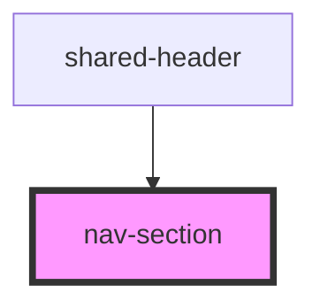

# nav-section

<!-- Auto Generated Below -->

## Properties

| Property        | Attribute        | Description | Type      | Default     |
| --------------- | ---------------- | ----------- | --------- | ----------- |
| `activeSection` | `active-section` |             | `any`     | `undefined` |
| `id`            | `id`             |             | `string`  | `undefined` |
| `isActive`      | `is-active`      |             | `boolean` | `false`     |
| `onActivate`    | `on-activate`    |             | `any`     | `undefined` |

## Dependencies

### Used by

 - [shared-header](..)

### Graph

----------------------------------------------

*Built with [StencilJS](https://stenciljs.com/)*
