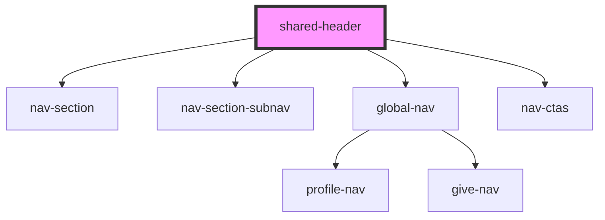

# shared-header

<!-- Auto Generated Below -->

## Properties

| Property | Attribute | Description | Type     | Default     |
| -------- | --------- | ----------- | -------- | ----------- |
| `env`    | `env`     |             | `string` | `'prod'`    |
| `src`    | `src`     |             | `string` | `undefined` |

## Dependencies

### Depends on

- [nav-section](nav-section)
- [nav-section-subnav](nav-section-subnav)
- [global-nav](global-nav)
- [nav-ctas](nav-ctas)

### Graph

----------------------------------------------

*Built with [StencilJS](https://stenciljs.com/)*
